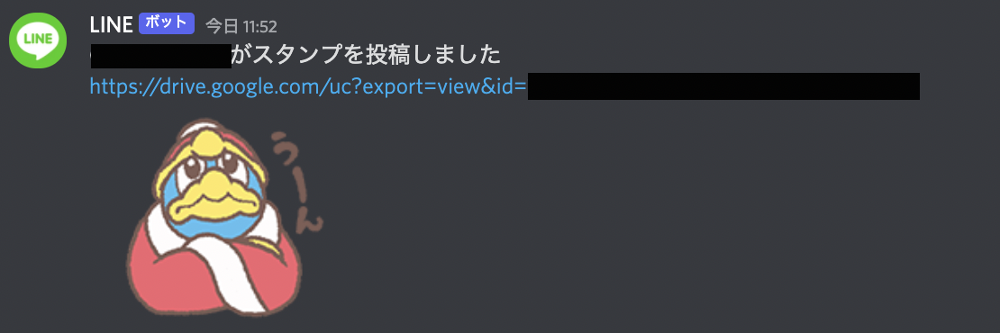
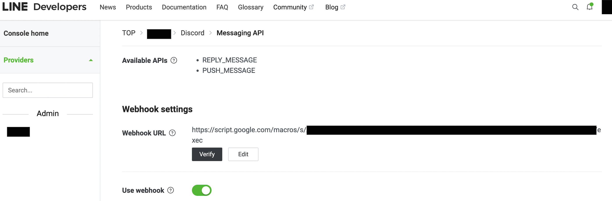

# line2discord



Google Apps Script(以降、gas) で LINEからDiscord にメッセージの転送をするプログラムです。

あくまで、`LINE -> Discord` のみの転送です。 `Discord -> LINE` には対応していません。

## 機能

今のところ、転送できるメッセージは

- テキストメッセージ
- 画像
- LINEスタンプ

になっています。

LINEスタンプはアニメーション、音声付きスタンプ、メッセージ付きスタンプには対応していません。(すべて画像スタンプとして処理されます)

## 使い方

### 必要なもの

- DiscordのWebhook URL
- Googleドライブのフォルダ
- LINEの Messaging API のアクセストークン

Discordはアップロードできるファイルサイズに上限があるので、ファイルはGoogleドライブに保存しそのURLをDiscordに送信しています。

対象のGoogleドライブのフォルダは`共有 > リンクを取得`で`リンクを知っている全員`に設定してある必要があります。

### gasのセットアップ

**1. コンフィグの作成**

`src/_.ts`を作成して、次のように定義してください。

```ts
// DiscordのWebhookのURL
// e.g. https://discord.com/api/webhooks/944444000011111777/uxxxxxxxxxxxx_o-3IBBxxxxxxxxxJYTr31exxxxxxxxNukjN1gQe10rxxxxxxxxxxxx
const DISCORD_WEBHOOK_URL = 'DISCORD_WEBHOOK_URL';

// GoogleドライブのフォルダのID
// https://drive.google.com/drive/u/0/folders/XXXX の XXXX の部分
const GDRIVE_FOLDER_ID = 'FOLDER_ID';

// LINEの Messaging API のアクセストークン
const LINE_MESSAGING_API_ACCESS_TOKEN = 'LINE_MESSAGING_API_ACCESS_TOKEN';
```

**2. GASへのログイン**

1でコンフィグを定義したら、次のコマンドを実行してください。

```sh
> yarn
> yarn clasp login
> yarn clasp create --type standalone --parentId PARENT_ID --title TITLE
```

最後に、サービスで`Drive API`を選んで追加してください。

### デプロイ

```sh
> yarn deploy
```

gasのデプロイは、

- 種類: `ウェブアプリ`
- 次のユーザーとして実行: `自分(email)`
- アクセスできるユーザー: `全員`

としてデプロイしてください。

gasがデプロイできたらウェブアプリのURL(例: `https://script.google.com/macros/s/xxxxxxxxxxxxxxxxxxxxxx/exec`)を、LINE Developersで`Messaging API > Webhook settings`に貼り付けてください。



## 参考記事

- [【ゼロから解説】LINEとDiscordのグループをbotで接続する【無料･高速･鯖いらず】](https://qiita.com/i_tatte/items/6cd8d9ce0a93df249937)
- [doubleplusc/Line-sticker-downloader](https://github.com/doubleplusc/Line-sticker-downloader)
