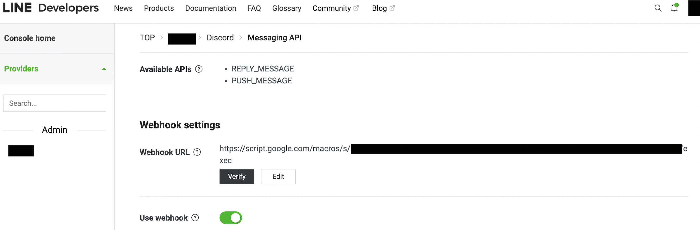
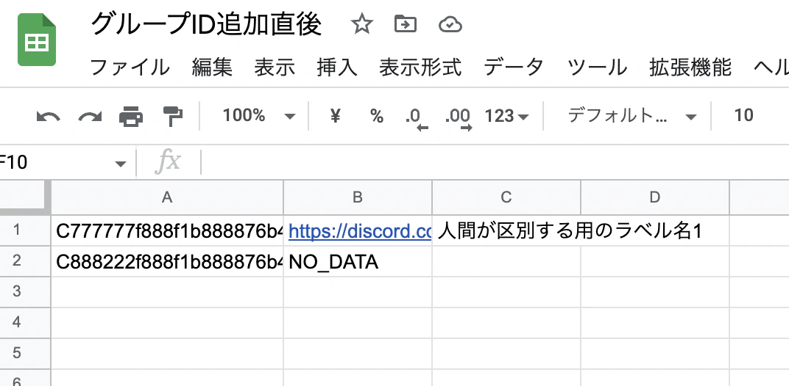

# line2discord

Google Apps Script(以降、gas) で LINEからDiscord にメッセージの転送をするプログラムです。

あくまで、`LINE -> Discord` のみの転送です。 `Discord -> LINE` には対応していません。

GASのスクリプトとLINEアプリ1つで、複数のグループの`LINE -> Discord`の転送が行えます。

## 機能

今のところ、転送できるメッセージは

- テキストメッセージ
- 画像
- LINEスタンプ

になっています。

LINEスタンプはアニメーション、音声付きスタンプ、メッセージ付きスタンプには対応していません。(すべて画像スタンプとして処理されます)

## 使い方

### 必要なもの

- DiscordのWebhook URL
- Googleドライブのフォルダ
- 新しいGoogleスプレッドシート
- LINEの Messaging API のアクセストークン

Discordはアップロードできるファイルサイズに上限があるので、ファイルはGoogleドライブに保存しそのURLをDiscordに送信しています。

対象のGoogleドライブのフォルダは`共有 > リンクを取得`で`リンクを知っている全員`に設定してある必要があります。

Googleスプレッドシートは、転送元のLINEグループIDと転送先のDiscordチャンネルの対応表として利用します。

### GASのセットアップ

**1. コンフィグの作成**

`src/_.ts`を作成して、次のように定義してください。

```ts
// GoogleドライブのフォルダのID
// https://drive.google.com/drive/u/0/folders/XXXX の XXXX の部分
const GDRIVE_FOLDER_ID = 'FOLDER_ID';

// LINEのグループID と DiscordのWebhook URLの対応表
// https://docs.google.com/spreadsheets/d/XXXX/edit の XXXX の部分
const GSHEET_ID = 'GOOGLE_SPREAD_SHEET_ID';

// LINEの Messaging API のアクセストークン
const LINE_MESSAGING_API_ACCESS_TOKEN = 'LINE_MESSAGING_API_ACCESS_TOKEN';
```

**2. GASへのログイン**

1で設定ファイルを作成したら、次のコマンドを実行してください。

```sh
> yarn
> yarn clasp login
> yarn clasp create --type standalone --parentId PARENT_ID --title TITLE
```

`PARENT_ID` は GASプロジェクトを置きたいGoogleドライブのフォルダのIDです。

**3. GASへのデプロイ**

```sh
> yarn deploy
```

gasがデプロイできたらウェブアプリのURL(例: `https://script.google.com/macros/s/xxxxxxxxxxxxxxxxxxxxxx/exec`)を、LINE Developersで`Messaging API > Webhook settings`に貼り付けてください。



もし、Verifyして 403エラー が起きる場合は、gasのコンソールで再デプロイを行なって Googleドライブへのアクセスを承認する必要があります。

### LINEのセットアップ

GASのデプロイ後は、

1. botを転送元のグループに呼んで、誰かが適当にLINEに投稿する
    - LINEのグループIDを取得するためのものです。
    - この投稿は転送されませんし、投稿内容は何でも大丈夫です。
    - スプレッドシートの最終行の列AにLINEグループIDが追加されます(変更しちゃダメ)
2. スプレッドシート(設定ファイルの`GSHEET_ID`で指定したもの)の最終行の`NO_DATA`部分にDiscordのWebhook URLを入れる
    - この作業は手作業で行なってください

必要があります。



スプレッドシートの列Aと列B以外は動作に影響しないので、区別しやすいように列Cに名前をつけたりなど、好きにやってもらって大丈夫です。

## 参考記事

- [【ゼロから解説】LINEとDiscordのグループをbotで接続する【無料･高速･鯖いらず】](https://qiita.com/i_tatte/items/6cd8d9ce0a93df249937)
- [doubleplusc/Line-sticker-downloader](https://github.com/doubleplusc/Line-sticker-downloader)
